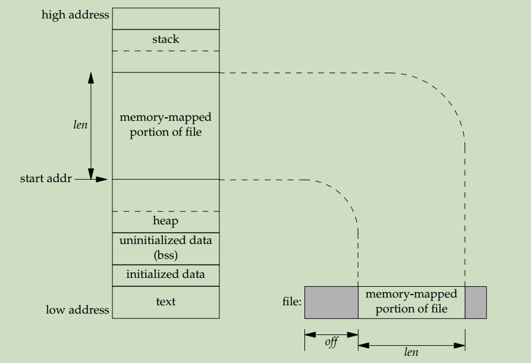

# Memory Mappings

记录内存映射的相关知识，内容主要来自 TLPI 的第 49 章和 APUE 的第 14.8 节。

[toc]

# 1. 概述

使用 `mmap` 系统调用可以在调用进程的虚拟地址空间中创建一个新的内存映射。映射分为两种： 

- 文件映射（file-based mapping or memory-mapped file）：将一个文件的一部分区域直接映射到调用进程的虚拟内存中。一旦映射完成，就可以通过操作相应内存区域中的字节来访问文件内容。
- 匿名映射（anonymous mapping）：没有对应的底层文件，页中的内容被初始化为 0 。

一个进程的映射可以和其他进程的映射共享，**<font color=red>此时各个进程的页表项指向 RAM 中的同一个物理页</font>**。这种现象出现的情况有两种：

- 两个进程映射了同一文件的同一区域。
- 通过 `fork` 创建的子进程会继承其父进程的内存映射，并引用同一个物理页。

根据映射是 **私有** 的还是 **共享** 的，决定了当多个进程引用同一个物理页时，一个进程是否可以看到其他进程对映射的内容做出的变更：

- 私有映射（`MAP_PRIVATE`）：对映射内容的变更对其他进程是不可见的。对于文件映射，变更不会发生在底层文件上。内核使用了 **<font color=red>写时复制（copy-on-write）</font>** 技术来完成这个任务。
- 共享映射（`MAP_SHARED`）：一个进程对映射内容的变更对其他进程都是可见的。对于文件映射，变更会发生在底层文件上。

上边的 2 种映射特性两两组合可以有 4 种结果，它们的用途分别如下。这些用途都会在 [第 5 节](#5. 文件映射) 和 [第 6 节](#6. 匿名映射) 中详细介绍。

|           私有文件映射           |           私有匿名映射           |           共享文件映射            |    共享匿名映射    |
| :------------------------------: | :------------------------------: | :-------------------------------: | :----------------: |
| 使用文件内容来初始化一块内存区域 | 为一个进程分配（用零填充的）内存 | 内存映射 I/O 和无关进程之间的通信 | 相关进程之间的通信 |

一个进程在执行 `exec` 时映射会丢失，而执行 `fork` 创建的子进程则会继承映射内容及映射类型（即 `MAP_PRIVATE` 或 `MAP_SHARED` ）。

# 2. 创建映射： `mmap` 系统调用

使用 [`mmap`](https://man7.org/linux/man-pages/man2/mmap.2.html) 系统调用来创建内存映射：

```c
#include <sys/mman.h>

void *mmap(void *addr, size_t length, int prot, int flags, int fd, off_t offset);
```

参数 `addr` 表示映射被放置的虚拟地址。首选做法是将其设为 `NULL` ，此时内核会自动选择一个合适的地址。

参数 `length` 是一个正整数，指定了要映射的字节数。虽然它没必要是系统页大小（调用 `sysconf(_SC_PAGE_SIZE)` 的返回值）的整数倍，但 **由于内核以页为单位来创建映射** ，所以它会被提升为下一个页大小的倍数后再来创建映射。

参数 `prot` 指定施加于映射上的保护信息。它的值要么是 `PROT_NONE` （无法访问），要么是 `PROT_READ` （可读取）、 `PROT_WRITE` （可修改）和 `PROT_EXEC` （可执行）三者中一个或多个的组合。

> 参数 `prot` 的值不能和文件访问模式（即 `O_RDONLY` 、`O_WRONLY` 和 `O_RDWR` 标志）产生冲突；在一些硬件架构上，参数 `prot` 的值的含义很微妙（ [第 5 节第 1 段](# 5. 文件映射) 解释了原因），详见 [VSRSIONS](https://man7.org/linux/man-pages/man2/mmap.2.html#VERSIONS) 中第一段的描述。

参数 `flags` 是用于控制映射的其他各个方面的位掩码。它必须包含且只能包含 `MAP_PRIVATE` 、 `MAP_SHARED` 和 `MAP_SHARED_VALIDATE` （Since Linux 4.15）中的一个。除此之外，还可以包含任意个 [其他值](https://man7.org/linux/man-pages/man2/mmap.2.html#DESCRIPTION) 。

在创建匿名映射时，参数 `fd` 和 `offset` 会被忽略。对于文件映射，参数 `fd` 表示被映射文件的文件描述符，参数 `offset` 表示映射在文件中的起始位置，**它必须是页大小的整数倍**。

调用成功时返回映射的起始地址。调用失败时返回 `MAP_FAILED -- (void *) -1` 并将 `errno` 设为 [对应的值](https://man7.org/linux/man-pages/man2/mmap.2.html#ERRORS) 。

示例程序如下：

```c
/* 
   mmcat.c
   
   Use mmap() plus write() to display the contents of a 
   file (specified as a command-line argument) on standard output.
*/
#include <sys/mman.h>
#include <sys/stat.h>
#include <fcntl.h>
#include "tlpi_hdr.h"

int main(int argc, char *argv[])
{
    if (argc != 2 || strcmp(argv[1], "--help") == 0)
        usageErr("%s file\n", argv[0]);
    
    // 打开文件
    int fd;
    fd = open(argv[1], O_RDONLY);
    if (fd == -1)
        errExit("open");
    
    // 获取文件大小作为要创建的映射的大小
    struct stat sb;
    if (fstat(fd, &sb) == -1)
        errExit("fstat");
    
    // 对长度为 0 的文件特殊处理
    // 因为创建大小为 0 的映射会失败
    if (sb.st_size == 0)
        exit(EXIT_SUCCESS);

    char *addr;
    addr = mmap(NULL, sb.st_size, PROT_READ, MAP_PRIVATE, fd, 0);
    if (addr == MAP_FAILED)
        errExit("mmap");

    if (write(STDOUT_FILENO, addr, sb.st_size) != sb.st_size)
        fatal("partial/failed write");
    // 进程退出时其打开的文件描述符自动关闭
    exit(EXIT_SUCCESS);
}
```

# 3. 解除映射： `munmap` 系统调用

使用 [`munmap`](https://man7.org/linux/man-pages/man2/munmap.2.html) 系统调用来从调用进程的虚拟内存中删除一个内存映射：

```c
#include <sys/mman.h>

int munmap(void *addr, size_t length);
```

参数 `addr` 表示待删除映射区域的起始地址，它必须是页对齐的。

参数 `length` 是非负整数，表示待删除区域的字节数。同样地，它也会被提升为下一个页的倍数后再来删除映射。

调用成功时返回 0 （如果由参数指定的地址范围中不存在映射也会视为调用成功），失败时返回 -1 。

最常见的情况是解除一个完整的映射，此时将 `addr` 设为上一次 `mmap` 调用返回的地址，将 `length` 的值设为与 `mmap` 中的 `length` 相同的值。除此之外，还可以解除一个映射中的部分映射、解除某个范围内的所有映射。

在解除映射时，内核会删除进程持有的在指定地址范围内的所有内存锁（通过 [`mlock`](https://man7.org/linux/man-pages/man2/mlock.2.html) 和 [`mlockall`](https://man7.org/linux/man-pages/man2/mlockall.2.html) 系统调用来创建）。

对于一个共享映射，为了确保映射内容被写入到底层文件中，需要在解除映射前使用下一节所描述的 `msync` 系统调用。

# 4. 同步映射： `msync` 系统调用

内核会自动将发生在共享映射上的变更写入到底层文件中，但却并没有保证这种操作会在什么时刻发生。使用 [`msync`](https://man7.org/linux/man-pages/man2/msync.2.html) 系统调用则可以显示地控制这种同步， **<font color=red>使用 `msync` 还可以确保在映射上发生的变更对其他在底层文件上进行 `read` 调用的进程是可见的</font>**  ：

```c
#include <sys/mman.h>

int msync(void *addr, size_t length, int flags);
```

参数 `addr` 和 `length` 的含义与 `munmap` 中的含义相同。参数 `flags` 可以选择 `MS_SYNC` 和 `MS_ASYNC` 中的一个：

- `MS_SYNC` ：同步写入，调用会阻塞直到所有被修改的页被写入到磁盘。操作完成后，**内存区域会与磁盘同步** 。
- `MS_ASYNC` ：异步写入，调用立即返回。它使得被修改的内容立即对其他在文件上执行 `read` 调用的进程可见，而被修改的页面会在后面某个时刻写入磁盘。操作完成后，**内存区域会与内核高速缓冲区同步** 。

除此之外，还可以添加一个 `MS_INVALIDATE` 标志。它会使所有其他共享同一底层文件的其他映射失效。这样，下次要引用页面时就必须从文件中加载新的内容，从而做到了其他进程对文件的更新在内存区域中也是可见的。

# 5. 文件映射

要创建文件映射，通常需要使用 `open` 调用来获取一个文件描述符。在打开文件时，文件访问模式标志位只能指定为 `O_RDONLY` 或 `O_RDWR` 而不能使用 `O_WRONLY` 标志，这是因为一些硬件架构不允许对页进行只写访问。正如第 2 节所描述的那样，参数 `offset` 和 `length` 共同指定了文件的哪一部分会被映射：



## 5.1 私有文件映射

私有文件映射最常见的用途如下：

- 使多个执行同一程序或使用同一共享库的进程共享相同的文本段，其分别从同一可执行文件或库文件映射而来。
- 映射同一个可执行文件或共享库的初始化数据段（initialized data segment）。

在这两种情况下使用私有映射的原因是显然的：对映射内容的修改肯定不能反映到底层的可执行文件和共享库上。最后要注意的是，**<font color=red>这两种用途都是由程序加载器和动态连接器创建的而对用户程序不可见</font>** 。


接下来的两小节都是针对共享映射的。

## 5.2 内存映射 I/O

内存映射 I/O 是指通过直接操作共享文件映射的内存区域的字节来执行文件 I/O 的技术。它相比 `read` 和 `write` 的优势在于：在性能方面，它避免了在用户缓冲区和内核缓冲区之间的数据传输；在操作方面，它简化了一些操作逻辑。

## 5.3 使用共享文件映射的 IPC

由于多个进程共享同一个物理页，所以共享文件映射还可以用作 IPC ，这种 IPC 方法相比 System V 共享内存对象的一个突出特性是共享内存区域的内容可以被持久化到磁盘上，这样程序在重启时可以再次使用其中的内容。

# 6. 匿名映射

在 Linux 上有两种不同但等价的创建匿名映射的方法：

1. 在参数 `flags` 中使用 `MAP_ANONYMOUS` 标志并将 `fd` 设为 -1 、将 `offset` 设为 0 （源自 BSD 的方法）。
2. 打开 `/dev/zero` 文件并将文件描述符传递给 `fd` 参数并将 `offset` 设为 0 （源自 System V 的方法）。

## 6.1 私有匿名映射

私有匿名映射用来分配进程私有的内存块并将内容初始化为 0 。在 glibc 的 `malloc` 实现中，会使用这种方法来分配大小大于 `MMAP_THRESHOLD` 字节的内存块。后续调用 `free` 时会通过 `munmap` 来释放。

## 6.2 共享匿名映射

共享匿名映射（Since Linux 2.4）允许相关进程（父进程和子进程）共享同一块内存区域，下面的程序演示了这种用途：

```c
// 根据是否定义 USE_MAP_ANON 宏来选择使用哪种方法
#define USE_MAP_ANON

// 使用第一种方法需要定义 _DEFAULT_SOURCE 特性测试宏
// 使用 gcc 11.4.0 和 glibc 2.35 编译时提示 _BSD_SOURCE 和 _SVID_SOURCE 宏已经废弃
#ifdef USE_MAP_ANON
#define _DEFAULT_SOURCE
#endif

#include <sys/wait.h>
#include <sys/mman.h>
#include <fcntl.h>

#include "tlpi_hdr.h"

int main(int argc, char *argv[])
{
    int *addr;
    
    // 在父进程中创建内存映射
#ifdef USE_MAP_ANON
    // 使用第一种方法
    addr = mmap(NULL, sizeof(int), PROT_READ | PROT_WRITE, MAP_SHARED | MAP_ANONYMOUS, -1, 0);
    if (addr == MAP_FAILED)
        errExit("mmap");
#else
    // 使用第二种方法
    int fd;
    fd = open("/dev/zero", O_RDWR);
    if (fd == -1)
        errExit("open");
    addr = mmap(NULL, sizeof(int), PROT_READ | PROT_WRITE, MAP_SHARED, fd, 0);
    if (addr == MAP_FAILED)
        errExit("mmap");
    if (close(fd) == -1)
        errExit("close");
#endif

    *(int *)addr = 1;
    
    // 父子进程共享同一块内存区域
    switch (fork()) {
    case -1:
        errExit("fork");
    case 0:
        // 子进程：将整数加一然后退出
        printf("Child started, value = %d\n", *(int *)addr);
        (*(int *)addr)++;
        if (munmap(addr, sizeof(int)) == -1)
            errExit("munmap");
        exit(EXIT_SUCCESS);
    default:
        // 父进程：等待子进程结束
        if (wait(NULL) == -1)
            errExit("wait");
        printf("In parent, value = %d\n", *(int *)addr);
        if (munmap(addr, sizeof(int)) == -1)
            errExit("munmap");
        exit(EXIT_SUCCESS);
    }
}
```

# 7. Linux 专有特性： `mremap` 调用和非线性映射

在大部分 UNIX 实现中， **<font color=red>一旦内存映射完成，其位置和大小都无法改变</font>** 。但是 Linux 提供了（不可移植的） [`mremap`](https://man7.org/linux/man-pages/man2/mremap.2.html) 系统调用来执行变更，可以扩张、收缩、移动已经存在的内存映射，详见手册页的描述；对于 `mmap` 创建的内存映射，文件的分页和内存的分页存在顺序的一一对应关系，但有时一些应用程序需要创建非线性映射。从内核 2.6 开始 Linux 提供了 [`remap_file_pages`](https://man7.org/linux/man-pages/man2/remap_file_pages.2.html) 系统调用，它通过调整页表来创建非线性映射。但是这个系统调用在 Linux 3.16 就被废弃了，详见手册页和 [The possible demise of remap_file_pages()](https://lwn.net/Articles/597632/) 的解释。

